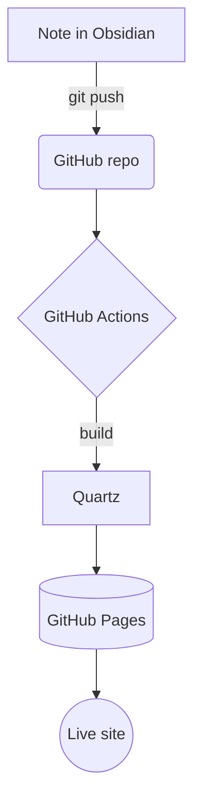
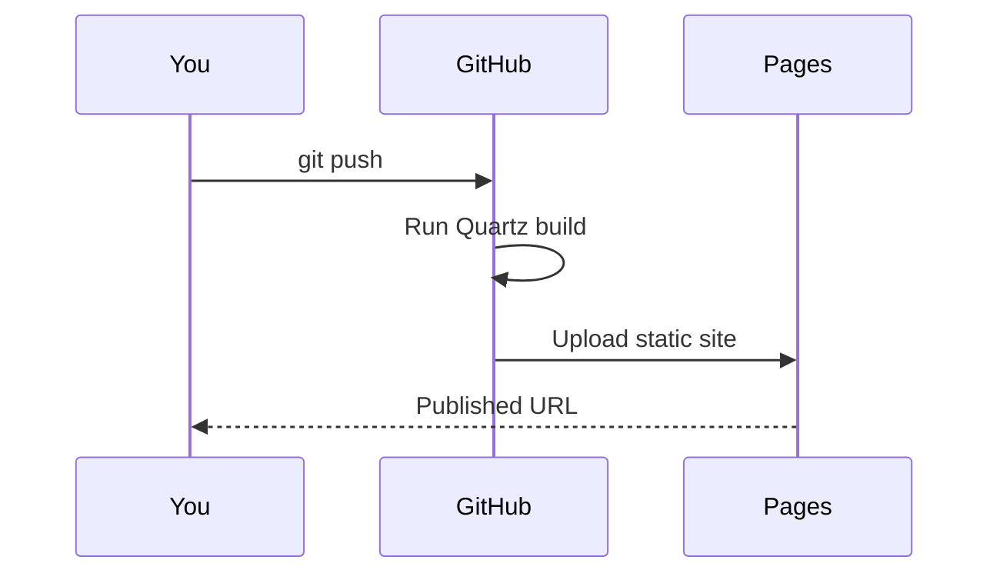
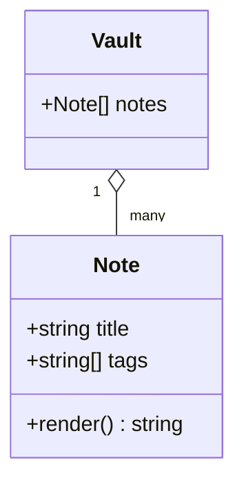

Quartz renders [Mermaid](https://mermaid.js.org) diagrams from a ` ```mermaid `
code fence (enabled via the `mermaid: true` option on the Obsidian-flavored
Markdown plugin).

## Flowchart



## Sequence diagram



## Class / entity diagram



These render as real SVG diagrams in the browser — try toggling dark mode and
they'll re-theme. Back to the [[features/index|feature tour]].
