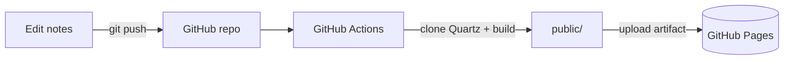

This is exactly how the site you're reading gets built and published — no manual
deploys, just `git push`.



> [!info] The idea
> This repo only contains the **vault** (`content/`) plus a config and a
> workflow. The Quartz engine itself is **not** committed — the workflow fetches
> it at build time. That keeps the repo tiny and easy to update.

## 1. Repository layout

```
your-repo/
├─ content/                 # your Obsidian vault
│  ├─ index.md              # REQUIRED — becomes the home page
│  └─ ...notes & folders
├─ quartz.config.yaml       # site config (title, baseUrl, plugins)
└─ .github/workflows/deploy.yml
```

> [!warning] You need a `content/index.md`
> Quartz builds the home page from `content/index.md`. Without it, the site root
> 404s and GitHub serves something random (often the RSS feed). The file must be
> named exactly `index.md` — emoji/prefixed names like `📇 index.md` won't work.

## 2. The workflow

Create `.github/workflows/deploy.yml`:

```yaml
name: Deploy Quartz

on:
  push:
    branches: [main]
  workflow_dispatch:

permissions:
  contents: read
  pages: write
  id-token: write

concurrency:
  group: pages
  cancel-in-progress: false

jobs:
  build:
    runs-on: ubuntu-latest
    steps:
      - name: Checkout content repo
        uses: actions/checkout@v4
        with:
          lfs: true           # only needed if you store assets in Git LFS
          path: repo

      - name: Checkout Quartz framework
        uses: actions/checkout@v4
        with:
          repository: jackyzha0/quartz
          ref: v5             # match the version in your package.json
          path: quartz

      - name: Inject vault content into Quartz
        run: |
          rm -rf quartz/content
          cp -r repo/content quartz/content
          if [ -f repo/quartz.config.yaml ]; then
            cp repo/quartz.config.yaml quartz/quartz.config.yaml
          fi

      - uses: actions/setup-node@v4
        with:
          node-version: 22

      - name: Install dependencies and build
        working-directory: quartz
        run: |
          npm ci
          npx quartz plugin install
          npx quartz build

      - uses: actions/upload-pages-artifact@v3
        with:
          path: quartz/public

  deploy:
    needs: build
    runs-on: ubuntu-latest
    environment:
      name: github-pages
      url: ${{ steps.deployment.outputs.page_url }}
    steps:
      - id: deployment
        uses: actions/deploy-pages@v4
```

## 3. The config (mind the `baseUrl`!)

In `quartz.config.yaml`, set `baseUrl` to where the site actually lives.

> [!danger] Project sites use a sub-path
> A repo named `my-vault` publishes to `https://<user>.github.io/my-vault/`.
> The `baseUrl` **must include that sub-path**, with no protocol and no trailing
> slash — otherwise CSS/JS and links break.

```yaml
configuration:
  pageTitle: My Digital Garden
  baseUrl: <user>.github.io/<repo>   # e.g. dm-mzzkh.github.io/test-actuions-vault
  # ...rest of the plugins/theme
```

If you instead use a **user/org site** (`<user>.github.io`) or a custom domain,
set `baseUrl` to just that domain (and re-enable the `cname` plugin for a custom
domain).

## 4. Turn on GitHub Pages

In the repo: **Settings → Pages → Build and deployment → Source = "GitHub
Actions"**. (Not "Deploy from a branch" — the workflow above publishes the
artifact directly.)

## 5. Push

```bash
git add .
git commit -m "Publish vault with Quartz"
git push
```

Watch the run under the **Actions** tab. When it's green, your site is live at
the `baseUrl` you configured. 🎉

## Troubleshooting

| Symptom | Cause | Fix |
| --- | --- | --- |
| `bootstrap-cli.mjs: not found` | Quartz engine missing from repo | The workflow fetches it — see step 2 |
| Site root shows raw XML / RSS | No `content/index.md` | Add a home page named exactly `index.md` |
| Unstyled page, broken links | Wrong `baseUrl` | Include the `/repo` sub-path (step 3) |
| Images don't load | Assets in Git LFS not fetched | Keep `lfs: true` on checkout |

---

Back to the [[index|vault home]] or browse the [[features/index|feature tour]].
