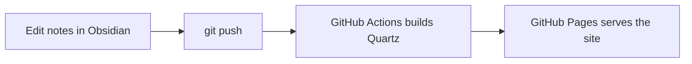

Welcome! 👋 This is a small [Obsidian](https://obsidian.md) vault published as a
website with [Quartz](https://quartz.jzhao.xyz). Every page here exists to show
off one feature you get **for free** when you turn your notes into a site.

> [!tip] Start here
> Open the **explorer** on the left, the **graph** on the right, and try the
> **search** in the top bar. They were all generated automatically from these
> notes — you didn't have to configure anything.

## What's inside

The notes are split into two folders (click a folder in the explorer to see its
auto-generated index page):

- [[features/index|🧩 Features]] — a tour of Markdown & Obsidian syntax
- [[guides/deploy-with-github-actions|🚀 Deploy guide]] — how this site builds itself

### Feature pages at a glance

| Page | Shows off |
| --- | --- |
| [[links]] | Wikilinks, aliases, backlinks, transclusion |
| [[callouts]] | Every callout / admonition type |
| [[formatting]] | Text styling, tables, tasks, footnotes |
| [[code-and-math]] | Syntax highlighting + LaTeX math |
| [[diagrams]] | Mermaid diagrams |
| [[media]] | Images and embeds |
| [[tags-and-metadata]] | Frontmatter & tags |

## How it works in one picture

Want to set up the exact same pipeline for your own vault? Read
[[deploy-with-github-actions|the deploy guide]].
